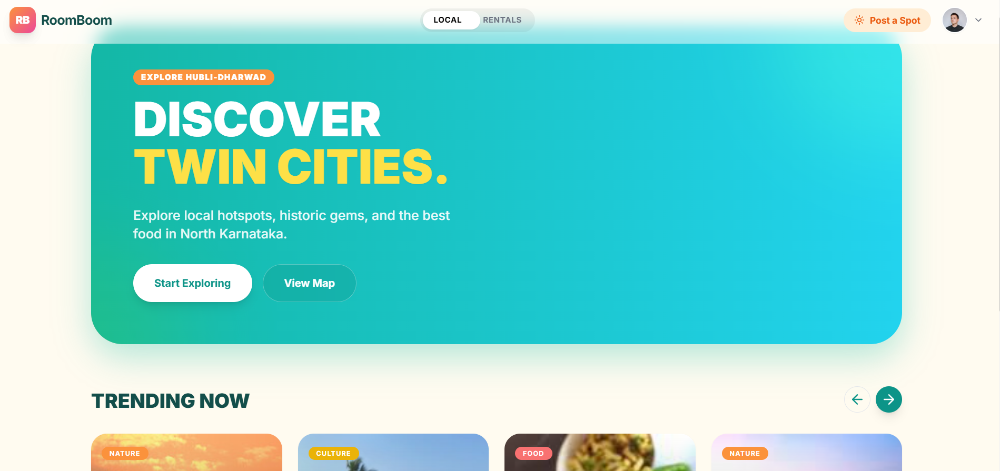
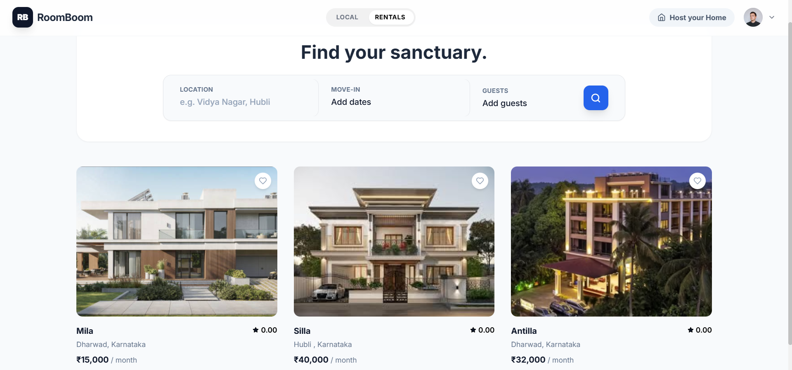

# RoomBoom

**RoomBoom** is a dual-purpose web platform that combines local discovery and residential living. Explore hidden gems in Hubli-Dharwad or find your perfect rental home - all in one place.

## Features

### 🗺️ Local Discovery
- **Explore Spots**: Discover cafes, parks, cultural sites, and hidden gems in Hubli-Dharwad
- **Interactive Map**: View all spots on an interactive map with colored markers
- **Categories**: Filter by Nature, Food, Culture, Chill, Active, and Adventure
- **Image Upload**: Share your favorite spots with multiple photos
- **Reviews & Ratings**: Rate and review places you've visited

### 🏡 Residential Rentals
- **Property Listings**: Browse apartments, houses, and PG accommodations
- **Detailed Filters**: Search by bedrooms, bathrooms, price, and amenities
- **Image Galleries**: View multiple photos of each property
- **Host Profiles**: Connect with verified property owners
- **Save Favorites**: Bookmark properties for later

### User Features
- **Authentication**: Secure login and signup
- **Create Posts**: Share spots and list properties
- **Manage Content**: Edit and delete your own posts
- **Share Links**: Copy shareable links for spots and listings

---

## Screenshots

### Dual Mode Interface

*Choose between Local Discovery and Residential Rentals*

### Local Discovery

*Explore local spots with beautiful card layouts*

### Rental Listings

*Browse residential properties with detailed information*

---

## 🛠️ Tech Stack

### Frontend
- **React** - UI library
- **Vite** - Build tool
- **React Leaflet** - Interactive maps
- **Axios** - HTTP client
- **Lucide React** - Icons

### Backend
- **Node.js** - Runtime environment
- **Express** - Web framework
- **MongoDB** - Database
- **Mongoose** - ODM
- **Multer** - File uploads
- **JWT** - Authentication
- **bcryptjs** - Password hashing

---

##  Getting Started

### Prerequisites
- Node.js (v14 or higher)
- MongoDB (local or MongoDB Atlas)
- Git

### Installation

1. **Clone the repository**
   ```bash
   git clone https://github.com/pEEk-rec/RoomBoom.git
   cd RoomBoom
   ```

2. **Setup Backend**
   ```bash
   cd backend
   npm install
   ```

   Create a `.env` file in the `backend` folder:
   ```env
   MONGO_URI=your_mongodb_connection_string
   JWT_SECRET=your_secret_key
   PORT=5000
   ```

3. **Setup Frontend**
   ```bash
   cd ../frontend
   npm install --legacy-peer-deps
   ```

### Running the Application

1. **Start Backend Server**
   ```bash
   cd backend
   npm run dev
   ```
   Backend runs on `http://localhost:5000`

2. **Start Frontend (in a new terminal)**
   ```bash
   cd frontend
   npm run dev
   ```
   Frontend runs on `http://localhost:5173`

3. **Open your browser** and navigate to `http://localhost:5173`

---

## 📁 Project Structure

```
RoomBoom/
├── backend/
│   ├── config/          # Configuration files
│   ├── models/          # Database models
│   ├── routes/          # API routes
│   ├── middleware/      # Custom middleware
│   ├── uploads/         # Uploaded images
│   └── server.js        # Entry point
│
├── frontend/
│   ├── src/
│   │   ├── components/  # React components
│   │   ├── context/     # Context providers
│   │   ├── api/         # API calls
│   │   └── App.jsx      # Main app component
│   └── index.html
│
└── README.md
```

---

## Key Features Explained

### Image Upload
Users can upload multiple images when creating spots or listings. Images are stored locally in the `backend/uploads` folder and served statically.

### Interactive Map
The map view uses Leaflet to display all discovery spots with color-coded markers based on categories. Click any marker to view spot details.

### Authentication
JWT-based authentication ensures secure user sessions. Users must be logged in to create, edit, or delete content.

### Responsive Design
The application features a modern, responsive design that works seamlessly on desktop and mobile devices.

---

## 🔒 Environment Variables

### Backend `.env`
```env
MONGO_URI=mongodb://localhost:27017/roomboom  # or MongoDB Atlas URI
JWT_SECRET=your_super_secret_jwt_key
PORT=5000
```

---

## 🤝 Contributing

Contributions are welcome! Feel free to open issues or submit pull requests.

---

## 📝 License

This project is open source and available under the MIT License.

---

## 👨‍💻 Author

**pEEk-rec**  
GitHub: [@pEEk-rec](https://github.com/pEEk-rec)


- Built with ❤️

**Happy Exploring! 🎉**
